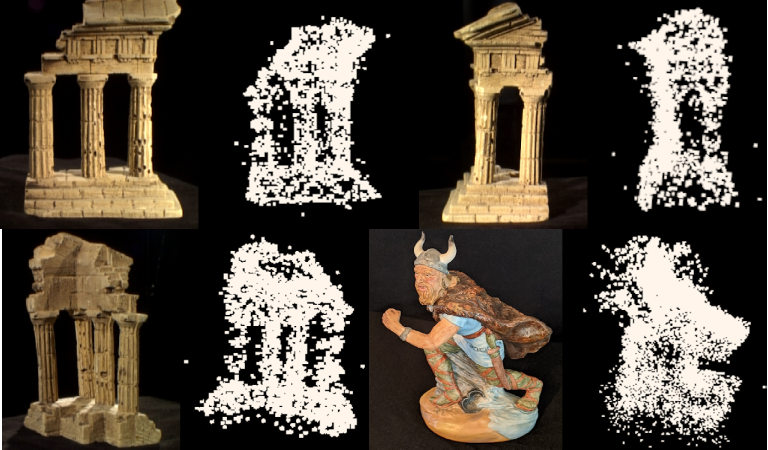

# An implementation of incremental Structure from Motion

Structure from motion is an algorithm that generates a 3D reconstruction (pointcloud) from a sequence of 2D images. Instructions on running the repo can be found below. The rough steps of my pipeline are: 

**i)** Match keypoints between images  
**ii)** Find a good image pair to initialize the reconstruction (many matches and significant rotation between images)  
**iii)** Extend the reconstruction by resecting adjacent images with PnP and triangulating new points  
**iv)** Refine camera parameters and 3D point coordinates with bundle adjustment regularly

Here are examples of the output I was able to generate:



Note: temple image set obtained from: http://vision.middlebury.edu/mview/data/. Viking image set was created by me. 

If desired, clone this repository and setup the conda environment:
```
git clone https://github.com/rshilliday/sfm.git
cd sfm
conda env create -n sfm -f environment.yml
conda activate sfm
```

Now, run jupyter:
```
jupyter notebook
```
Open main.ipynb and hit "run all" to generate a 3D reconstruction of the "templeRing" dataset.

To generate a reconstruction of the Viking dataset, in the second cell of main.ipynb change n_imgs to 49 and change the imgset parameter of `find_features()` to 'Viking', and then hit "run all".

If you would like to run this code on another dataset, you're welcome to do so, and the changes you'll need to make are as follows:

1. Go to the `find_features()` function in matching.py. 
2. After the `elif imgset == 'Viking:` conditional block, add the following:
```
elif imgset == '<Name-of-your-image-set-here>':
  img = cv2.imread(f'./datasets/<folder-with-your-images>/{i:02d}.<file-extension>', cv2.IMREAD_GRAYSCALE)
  K = # You will have to proivde an intrinsics matrix here
```
Then in the 2nd cell of main.ipynb, change n_imgs to however many images are in your dataset, and change the imgset parameter in `find_features` to the name of your image set, then hit run all.

Please note that my implementation assumes that all images are the same size and are taken in a ring around the object you want to reconstruct. So for example, the Viking images range from 00.jpg to 49.jpg where all consecutive images are adjacent and 00 and 49 are also adjacent.
